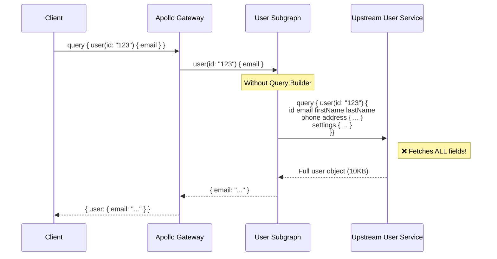
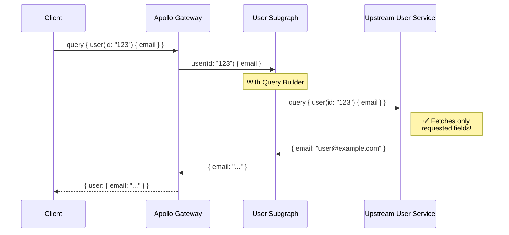
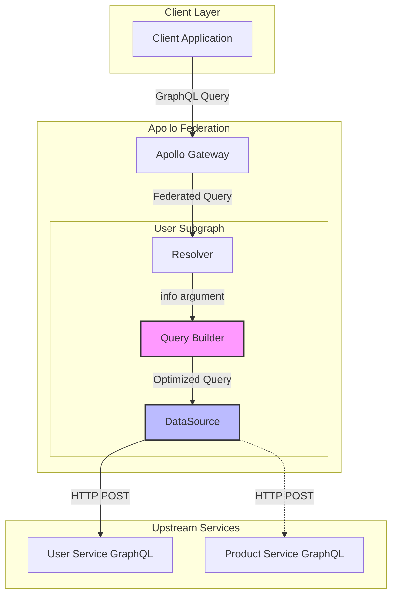
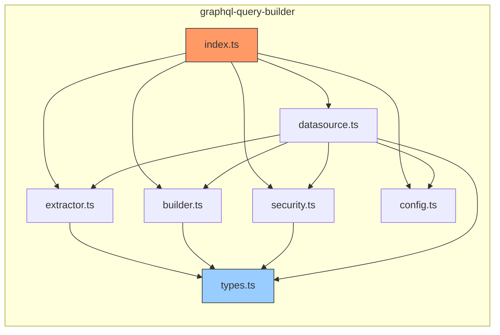
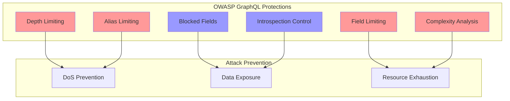
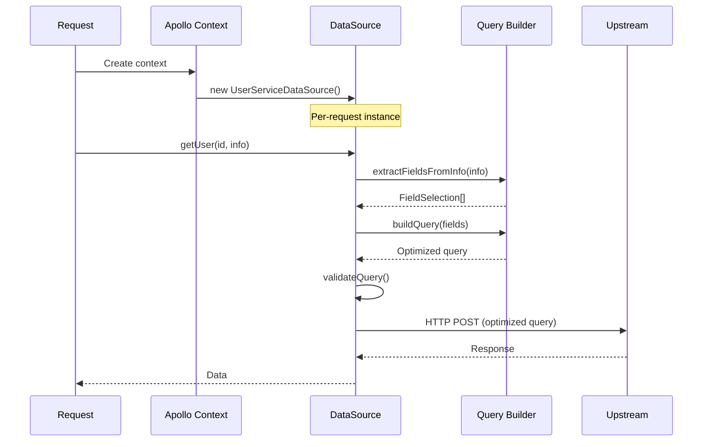

# graphql-query-builder

A TypeScript utility package for building optimized GraphQL queries in Apollo Federation subgraphs to prevent server-side overfetching.

[](https://github.com/yourusername/graphql-query-builder/actions/workflows/ci.yml)
[](https://www.typescriptlang.org/)
[](https://nodejs.org/)
[](https://www.apollographql.com/docs/apollo-server/)
[](LICENSE)
[](https://arethetypeswrong.github.io/)
[](https://publint.dev/)
[](https://codecov.io/gh/yourusername/graphql-query-builder)

## Table of Contents

- [Problem Statement](#problem-statement)
- [Solution Overview](#solution-overview)
- [Architecture](#architecture)
- [Installation](#installation)
- [Quick Start](#quick-start)
- [Configuration](#configuration)
- [API Reference](#api-reference)
- [Security](#security)
- [DataSource Integration](#datasource-integration)
- [Examples](#examples)
- [Best Practices](#best-practices)
- [Package Validation](#package-validation)
- [Contributing](#contributing)

## Problem Statement

In Apollo Federation architectures, subgraphs often communicate with upstream REST or GraphQL services. A common problem is **server-side overfetching**: when the client requests a subset of fields, the subgraph fetches ALL fields from the upstream service.

### Understanding Overfetching

```
┌──────────────────────────────────────────────────────────────────────────────────┐
│                        THE OVERFETCHING PROBLEM                                   │
├──────────────────────────────────────────────────────────────────────────────────┤
│                                                                                   │
│  Client Request:              What Actually Gets Fetched:                         │
│  ┌─────────────────┐          ┌─────────────────────────────────────────────┐    │
│  │ {                │          │ {                                           │    │
│  │   user(id: "1") {│   →→→    │   user(id: "1") {                           │    │
│  │     email        │          │     id                    ← Not requested   │    │
│  │   }              │          │     email                 ← Requested ✓     │    │
│  │ }                │          │     firstName             ← Not requested   │    │
│  └─────────────────┘          │     lastName              ← Not requested   │    │
│                                │     phone                 ← Not requested   │    │
│                                │     address { ... }       ← Not requested   │    │
│                                │     settings { ... }      ← Not requested   │    │
│                                │     preferences { ... }   ← Not requested   │    │
│                                │   }                                         │    │
│                                │ }                                           │    │
│                                └─────────────────────────────────────────────┘    │
│                                                                                   │
│  Result: 90% of data transferred is WASTED                                        │
│  Impact: ↑ Latency  ↑ Bandwidth  ↑ Memory  ↑ Cost                                │
└──────────────────────────────────────────────────────────────────────────────────┘
```

### Why This Happens

```
┌─────────────────────────────────────────────────────────────────────────────────┐
│                           TYPICAL RESOLVER PATTERN                               │
├─────────────────────────────────────────────────────────────────────────────────┤
│                                                                                  │
│   // The problem: Hard-coded query with ALL fields                               │
│   const resolvers = {                                                            │
│     Query: {                                                                     │
│       user: async (_, { id }) => {                                               │
│         // ❌ Always fetches everything, regardless of what client asked for     │
│         return await fetch(`/api/users/${id}`)  // Returns 50+ fields            │
│       }                                                                          │
│     }                                                                            │
│   }                                                                              │
│                                                                                  │
│   // What we need: Dynamic query based on client request                         │
│   const resolvers = {                                                            │
│     Query: {                                                                     │
│       user: async (_, { id }, context, info) => {  // 👈 Use `info`!            │
│         const fields = extractFieldsFromInfo(info)  // ✅ Extract requested     │
│         return await fetchUserWithFields(id, fields) // ✅ Fetch only those     │
│       }                                                                          │
│     }                                                                            │
│   }                                                                              │
│                                                                                  │
└─────────────────────────────────────────────────────────────────────────────────┘
```

### The Overfetching Problem - Sequence Diagram



### The Solution - Sequence Diagram



### Before vs After Comparison

```
┌─────────────────────────────────────────────────────────────────────────────────┐
│                         BANDWIDTH & LATENCY IMPACT                               │
├─────────────────────────────────────────────────────────────────────────────────┤
│                                                                                  │
│   WITHOUT Query Builder:                 WITH Query Builder:                     │
│   ┌─────────────────────────┐           ┌─────────────────────────┐             │
│   │ Request:  SELECT *      │           │ Request:  email only    │             │
│   │ Response: 10,240 bytes  │    →→→    │ Response: 128 bytes     │             │
│   │ Latency:  245ms         │           │ Latency:  52ms          │             │
│   │ Memory:   High          │           │ Memory:   Minimal       │             │
│   └─────────────────────────┘           └─────────────────────────┘             │
│                                                                                  │
│   Improvement:                                                                   │
│   ├── 98% reduction in response size                                            │
│   ├── 79% reduction in latency                                                  │
│   ├── Lower memory pressure on all services                                     │
│   └── Reduced cloud egress costs                                                │
│                                                                                  │
└─────────────────────────────────────────────────────────────────────────────────┘
```

## Solution Overview

This package solves the overfetching problem by:

1. **Extracting** the exact fields the client requested from the GraphQL resolver's `info` argument
2. **Building** an optimized query string that requests only those fields
3. **Validating** queries against security rules (depth limits, field limits, blocked fields)
4. **Integrating** with Apollo Server 4's DataSource patterns

### Key Features

- 🎯 **Precise Field Extraction** - Only request what the client needs
- 🔒 **OWASP Security Compliance** - Built-in protection against GraphQL attacks
- 🔄 **Dual Module Support** - Works with both ESM and CommonJS
- ⚙️ **Config-Based** - Uses `node-config` for flexible configuration
- 🔌 **DataSource Integration** - Ready-to-use Apollo DataSource classes
- 📝 **TypeScript First** - Full type safety with comprehensive types

## Architecture

### System Architecture



### Package Module Structure



### Module Responsibility Matrix

```
┌────────────────────────────────────────────────────────────────────────────────┐
│                        MODULE RESPONSIBILITIES                                  │
├─────────────────┬──────────────────────────────────────────────────────────────┤
│ Module          │ Purpose                                                      │
├─────────────────┼──────────────────────────────────────────────────────────────┤
│ extractor.ts    │ Parse GraphQL AST from resolver `info` argument             │
│                 │ Extract field selections with depth/path information         │
├─────────────────┼──────────────────────────────────────────────────────────────┤
│ builder.ts      │ Convert field selections into GraphQL query strings         │
│                 │ Handle variables, operation names, field mappings           │
├─────────────────┼──────────────────────────────────────────────────────────────┤
│ security.ts     │ OWASP-compliant validation (depth, field count, blocked)    │
│                 │ Sanitize field selections, remove dangerous fields          │
├─────────────────┼──────────────────────────────────────────────────────────────┤
│ datasource.ts   │ Apollo Server 4 DataSource base classes                     │
│                 │ Orchestrate extraction → building → validation → HTTP       │
├─────────────────┼──────────────────────────────────────────────────────────────┤
│ config.ts       │ node-config integration for runtime configuration           │
│                 │ Service endpoint management, security defaults              │
├─────────────────┼──────────────────────────────────────────────────────────────┤
│ errors.ts       │ Custom error types with rich metadata                       │
│                 │ ConfigurationError, QueryValidationError, etc.              │
├─────────────────┼──────────────────────────────────────────────────────────────┤
│ factories.ts    │ Factory functions for creating DataSource instances         │
│                 │ Per-request instantiation patterns                          │
└─────────────────┴──────────────────────────────────────────────────────────────┘
```

### Data Flow

```mermaid
flowchart LR
    subgraph Extraction
        INFO[GraphQLResolveInfo]
        EXT[extractFieldsFromInfo]
        FS[FieldSelection[]]
    end

    subgraph Building
        BUILD[buildQuery]
        QUERY[BuiltQuery]
    end

    subgraph Validation
        VAL[validateQuery]
        PASS{Valid?}
    end

    subgraph Execution
        DS[DataSource]
        UP[Upstream Service]
    end

    INFO --> EXT --> FS
    FS --> BUILD --> QUERY
    QUERY --> VAL --> PASS
    PASS -->|Yes| DS --> UP
    PASS -->|No| ERR[QueryValidationError]

    style EXT fill:#9f9,stroke:#333
    style BUILD fill:#99f,stroke:#333
    style VAL fill:#f99,stroke:#333
```

### Data Flow - Detailed Pipeline

```
┌─────────────────────────────────────────────────────────────────────────────────┐
│                           DATA TRANSFORMATION PIPELINE                           │
├─────────────────────────────────────────────────────────────────────────────────┤
│                                                                                  │
│   1. EXTRACTION PHASE                                                            │
│   ┌──────────────────────────────────────────────────────────────────────┐      │
│   │ Input: GraphQL AST from resolver `info` argument                      │      │
│   │                                                                       │      │
│   │   info.fieldNodes → parseResolveInfo() → FieldSelection[]            │      │
│   │                                                                       │      │
│   │ Output: [                                                             │      │
│   │   { name: 'id', path: ['user', 'id'], depth: 1 },                    │      │
│   │   { name: 'email', path: ['user', 'email'], depth: 1 },              │      │
│   │   { name: 'profile', path: ['user', 'profile'], depth: 1,            │      │
│   │     children: [{ name: 'avatar', ... }] }                            │      │
│   │ ]                                                                     │      │
│   └──────────────────────────────────────────────────────────────────────┘      │
│                              ↓                                                   │
│   2. BUILDING PHASE                                                              │
│   ┌──────────────────────────────────────────────────────────────────────┐      │
│   │ Input: FieldSelection[] + QueryBuildOptions                           │      │
│   │                                                                       │      │
│   │   buildQuery('user', fields, { variables: { id: '123' } })           │      │
│   │                                                                       │      │
│   │ Output: {                                                             │      │
│   │   query: 'query GetUser($id: ID!) { user(id: $id) { id email } }',   │      │
│   │   variables: { id: '123' },                                          │      │
│   │   metadata: { depth: 2, fieldCount: 3 }                              │      │
│   │ }                                                                     │      │
│   └──────────────────────────────────────────────────────────────────────┘      │
│                              ↓                                                   │
│   3. VALIDATION PHASE                                                            │
│   ┌──────────────────────────────────────────────────────────────────────┐      │
│   │ Input: BuiltQuery metadata + SecurityConfig                           │      │
│   │                                                                       │      │
│   │   validateQuery(3, 2, ['id', 'email'], { maxDepth: 10 })             │      │
│   │                                                                       │      │
│   │ Output: { valid: true, errors: [] }                                  │      │
│   │    OR   { valid: false, errors: ['Depth 12 exceeds max 10'] }        │      │
│   └──────────────────────────────────────────────────────────────────────┘      │
│                              ↓                                                   │
│   4. EXECUTION PHASE                                                             │
│   ┌──────────────────────────────────────────────────────────────────────┐      │
│   │ Input: Validated BuiltQuery                                           │      │
│   │                                                                       │      │
│   │   HTTP POST to upstream GraphQL service                               │      │
│   │   Headers: Content-Type, Authorization, custom headers                │      │
│   │                                                                       │      │
│   │ Output: Parsed JSON response data                                     │      │
│   └──────────────────────────────────────────────────────────────────────┘      │
│                                                                                  │
└─────────────────────────────────────────────────────────────────────────────────┘
```

## Installation

```bash
npm install graphql-query-builder
```

### Peer Dependencies

```bash
npm install graphql config
```

## Quick Start

### Basic Usage

```typescript
import { extractFieldsFromInfo, buildQuery } from 'graphql-query-builder';
import type { GraphQLResolveInfo } from 'graphql';

// In your resolver
const resolvers = {
  Query: {
    user: async (_, args, context, info: GraphQLResolveInfo) => {
      // 1. Extract fields the client requested
      const extracted = extractFieldsFromInfo(info);

      // 2. Build optimized query
      const { query, variables } = buildQuery('user', extracted.fields, {
        operationName: 'GetUser',
        variables: { id: args.id },
      });

      // 3. Execute against upstream service
      const response = await fetch('https://upstream.example.com/graphql', {
        method: 'POST',
        headers: { 'Content-Type': 'application/json' },
        body: JSON.stringify({ query, variables }),
      });

      return response.json();
    },
  },
};
```

### With DataSource (Recommended)

```typescript
import { GraphQLDataSource, setConfig } from 'graphql-query-builder';
import type { GraphQLResolveInfo } from 'graphql';

// Configure upstream services
setConfig({
  upstreamServices: {
    userService: {
      endpoint: 'https://users.internal.example.com/graphql',
      timeout: 5000,
      requiredFields: ['id'],
    },
  },
});

// Create custom data source
class UserServiceDataSource extends GraphQLDataSource {
  constructor() {
    super('userService');
  }

  async getUser(id: string, info: GraphQLResolveInfo) {
    return this.executeQuery('user', { id }, info);
  }
}

// Use in resolver
const resolvers = {
  Query: {
    user: async (_, args, context, info) => {
      return context.dataSources.userService.getUser(args.id, info);
    },
  },
};
```

## Configuration

### Using node-config

Create a configuration file in your `config/` directory:

```json
// config/default.json
{
  "graphqlQueryBuilder": {
    "maxDepth": 10,
    "maxFields": 100,
    "blockedFields": ["password", "ssn", "secretKey"],
    "upstreamServices": {
      "userService": {
        "endpoint": "https://users.internal.example.com/graphql",
        "timeout": 5000,
        "requiredFields": ["id"],
        "maxDepth": 5
      },
      "productService": {
        "endpoint": "https://products.internal.example.com/graphql",
        "timeout": 10000,
        "cacheConfig": {
          "enabled": true,
          "ttl": 60000
        }
      }
    }
  }
}
```

### Programmatic Configuration

```typescript
import { setConfig, registerUpstreamService } from 'graphql-query-builder';

// Set all configuration
setConfig({
  maxDepth: 10,
  maxFields: 100,
  blockedFields: ['password'],
  upstreamServices: {
    userService: {
      endpoint: 'https://users.example.com/graphql',
    },
  },
});

// Or register services individually
registerUpstreamService('orderService', {
  endpoint: 'https://orders.example.com/graphql',
  timeout: 15000,
});
```

### Environment Variables

```bash
# Global settings
GRAPHQL_QUERY_BUILDER_MAX_DEPTH=10
GRAPHQL_QUERY_BUILDER_MAX_FIELDS=100
GRAPHQL_QUERY_BUILDER_BLOCKED_FIELDS=password,ssn

# Service-specific
GRAPHQL_QUERY_BUILDER_USERSERVICE_ENDPOINT=https://users.example.com/graphql
GRAPHQL_QUERY_BUILDER_USERSERVICE_TIMEOUT=5000
```

```typescript
import { getConfigFromEnv, setConfig } from 'graphql-query-builder';

const envConfig = getConfigFromEnv();
setConfig(envConfig);
```

## API Reference

### Field Extraction

#### `extractFieldsFromInfo(info, options?)`

Extracts field selections from the GraphQL resolver's `info` argument.

```typescript
const extracted = extractFieldsFromInfo(info, {
  maxDepth: 5, // Limit extraction depth
  includeTypename: false, // Exclude __typename
});

// Returns:
// {
//   fields: FieldSelection[],
//   rootType: string,
//   depth: number,
//   fieldCount: number,
// }
```

#### `getRequestedFieldNames(info)`

Gets a flat list of all requested field names.

```typescript
const fieldNames = getRequestedFieldNames(info);
// ['id', 'email', 'profile', 'firstName', 'lastName']
```

#### `isFieldRequested(info, path)`

Checks if a specific field path was requested.

```typescript
if (isFieldRequested(info, 'profile.avatar')) {
  // Load avatar data
}
```

### Query Building

#### `buildQuery(rootType, fields, options?)`

Builds a GraphQL query string from field selections.

```typescript
const { query, variables, metadata } = buildQuery('user', fields, {
  operationName: 'GetUser',
  variables: { id: '123' },
  requiredFields: ['id'],
  fieldMappings: { email: 'emailAddress' },
  pretty: true,
});
```

#### `buildQueryFromPaths(rootType, fieldPaths, options?)`

Builds a query from dot-separated field paths.

```typescript
const { query } = buildQueryFromPaths('user', [
  'id',
  'email',
  'profile.firstName',
  'profile.avatar.url',
]);
```

### Security

#### `validateQuery(fieldCount, depth, fieldNames, config?)`

Validates a query against security rules.

```typescript
const result = validateQuery(50, 5, ['id', 'email'], {
  maxDepth: 10,
  maxFields: 100,
  blockedFields: ['password'],
});

if (!result.valid) {
  throw new Error(result.errors.join(', '));
}
```

#### `assertQueryValid(fields, config?)`

Validates and throws `QueryValidationError` if invalid.

```typescript
try {
  assertQueryValid(fields, { maxDepth: 5 });
} catch (error) {
  if (error instanceof QueryValidationError) {
    console.error('Validation errors:', error.errors);
  }
}
```

#### `sanitizeFieldSelections(fields, blockedFields)`

Removes blocked fields from selections.

```typescript
const sanitized = sanitizeFieldSelections(fields, ['password', 'ssn']);
```

### DataSource Classes

#### `GraphQLDataSource`

Abstract base class for creating data sources.

```typescript
class MyDataSource extends GraphQLDataSource {
  constructor() {
    super('serviceName');
  }

  protected override getAuthHeaders() {
    return { Authorization: `Bearer ${token}` };
  }
}
```

#### Pre-built DataSources

- `SimpleGraphQLDataSource` - No authentication
- `BearerAuthDataSource` - Bearer token auth
- `HeaderAuthDataSource` - Custom header auth

## Security

### OWASP Compliance

This package implements protections recommended by the [OWASP GraphQL Cheat Sheet](https://cheatsheetseries.owasp.org/cheatsheets/GraphQL_Cheat_Sheet.html):



### Security Configuration

```typescript
import { setConfig, validateFieldSelections } from 'graphql-query-builder';

// Configure global security limits
setConfig({
  maxDepth: 10, // Prevent deeply nested queries
  maxFields: 100, // Limit total fields per query
  blockedFields: [
    // Sensitive fields to block
    'password',
    'ssn',
    'secretKey',
    '__schema', // Block introspection in production
    '__type',
  ],
});

// Validate in resolver
const result = validateFieldSelections(fields, {
  maxDepth: 5,
  maxFields: 50,
  maxAliases: 10,
  maxComplexity: 500,
});
```

## DataSource Integration

### Apollo Server 4 Setup



### Implementation

```typescript
import { ApolloServer } from '@apollo/server';
import { startStandaloneServer } from '@apollo/server/standalone';
import { GraphQLDataSource, setConfig, createDataSourceFactory } from 'graphql-query-builder';

// Configure services
setConfig({
  upstreamServices: {
    userService: {
      endpoint: process.env.USER_SERVICE_URL!,
      timeout: 5000,
    },
  },
});

// Create data source class
class UserService extends GraphQLDataSource {
  constructor() {
    super('userService');
  }

  async getUser(id: string, info: GraphQLResolveInfo) {
    return this.executeQuery('user', { id }, info);
  }
}

// Create factory for request-scoped instances
const createUserService = createDataSourceFactory(UserService, 'userService');

// Setup Apollo Server
const server = new ApolloServer({ typeDefs, resolvers });

const { url } = await startStandaloneServer(server, {
  context: async ({ req }) => ({
    dataSources: {
      userService: createUserService(),
    },
  }),
});
```

## Examples

See the [examples](./examples) directory for complete examples:

- [Basic Usage](./examples/basic-usage.ts) - Field extraction and query building
- [DataSource Integration](./examples/datasource-integration.ts) - Apollo Server integration
- [Security Configuration](./examples/security-configuration.ts) - OWASP compliance

## Best Practices

### 1. Always Use Required Fields

```typescript
buildQuery('user', fields, {
  requiredFields: ['id', '__typename'], // For Apollo cache
});
```

### 2. Configure Service-Specific Limits

```typescript
setConfig({
  upstreamServices: {
    userService: {
      maxDepth: 5, // Sensitive service - stricter limits
    },
    productService: {
      maxDepth: 10, // Less sensitive - relaxed limits
    },
  },
});
```

### 3. Use DataSources for Request Scoping

```typescript
// Create new instance per request for proper isolation
context: async () => ({
  dataSources: {
    userService: new UserServiceDataSource(),
  },
});
```

### 4. Validate Before Execution

```typescript
const extracted = extractFieldsFromInfo(info);
assertQueryValid(extracted.fields); // Throws if invalid
const { query } = buildQuery('user', extracted.fields);
```

### 5. Monitor Query Complexity

```typescript
const complexity = calculateComplexity(fields);
if (complexity > threshold) {
  metrics.recordHighComplexityQuery(complexity);
}
```

## Package Validation

This package is validated for compatibility across different module resolutions using industry-standard tools.

### Validation Results

```
┌───────────────────┬──────────────────────────┐
│ Resolution        │ Status                   │
├───────────────────┼──────────────────────────┤
│ node10            │ ✅ Compatible            │
│ node16 (from CJS) │ ✅ Compatible (CJS)      │
│ node16 (from ESM) │ ✅ Compatible (ESM)      │
│ bundler           │ ✅ Compatible            │
└───────────────────┴──────────────────────────┘
```

### Running Validation

```bash
# Validate with both attw and publint
npm run validate

# Or run individually
npx attw --pack .
npx publint
```

### Dual Module Support Architecture

```
dist/
├── esm/                    # ES Modules (.js)
│   ├── index.js
│   ├── extractor.js
│   ├── builder.js
│   └── ...
├── cjs/                    # CommonJS (.cjs)
│   ├── index.cjs
│   ├── extractor.cjs
│   ├── builder.cjs
│   └── ...
└── types/                  # Type Declarations
    ├── index.d.ts          # For ESM consumers
    ├── index.d.cts         # For CJS consumers
    └── ...
```

## Module Formats

This package supports both ESM and CommonJS:

```typescript
// ESM (recommended)
import { extractFieldsFromInfo } from 'graphql-query-builder';

// CommonJS
const { extractFieldsFromInfo } = require('graphql-query-builder');
```

## TypeScript Support

Full TypeScript support with comprehensive type definitions:

```typescript
import type {
  FieldSelection,
  ExtractedFields,
  QueryBuildOptions,
  BuiltQuery,
  SecurityConfig,
  QueryBuilderConfig,
} from 'graphql-query-builder';
```

## Contributing

1. Fork the repository
2. Create your feature branch (`git checkout -b feature/amazing-feature`)
3. Commit your changes (`git commit -m 'Add amazing feature'`)
4. Push to the branch (`git push origin feature/amazing-feature`)
5. Open a Pull Request

### Development Setup

```bash
# Install dependencies
npm install

# Run tests
npm test

# Run tests with coverage
npm run test:coverage

# Build all formats
npm run build

# Validate package
npm run validate
```

## License

MIT
